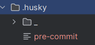

# Звіт виконаного завдання

## Ініціалізація проєкту

1. Клонування репозиторію:

```bash
git clone https://github.com/SN2006/SUITT-Year3-Software-Engineering-PZ2.git
```

2. Ініціалізуйте npm-проєкт:

```bash
npm init
This utility will walk you through creating a package.json file.
It only covers the most common items, and tries to guess sensible defaults.

See `npm help init` for definitive documentation on these fields
and exactly what they do.

Use `npm install <pkg>` afterwards to install a package and
save it as a dependency in the package.json file.

Press ^C at any time to quit.
package name: (suitt-year3-software-engineering-pz2) basic-utils
version: (1.0.0) 0.0.0
description: The library that provides useful functions
entry point: (index.js)
test command:
git repository:
keywords:
author: Viacheslav Niedieliev
license: (ISC)
About to write to D:\study\course3\software_engeneering\SUITT-Year3-Software-Engineering-PZ2\package.json:

{
  "name": "basic-utils",
  "version": "0.0.0",
  "description": "The library that provides useful functions",
  "main": "index.js",
  "scripts": {
    "test": "echo \"Error: no test specified\" && exit 1"
  },
  "author": "Viacheslav Niedieliev",
  "license": "ISC"
}


Is this OK? (yes)
```

3. Створіть файл .gitignore з таким вмістом:

```bash
.idea/
node_modules/
dist/
.env
```

4. Встановіть залежності:

```bash
npm i dotenv zod

added 2 packages, and audited 3 packages in 12s

2 packages are looking for funding
  run `npm fund` for details

found 0 vulnerabilities
```

```bash
npm i -D typescript tsup eslint prettier husky commitlint @commitlint/config-conventional @types/node tsx @eslint/js typescript-eslint eslint-config-prettier
npm WARN deprecated source-map@0.8.0-beta.0: The work that was done in this beta branch won't be included in future versions

added 296 packages, and audited 299 packages in 14s

78 packages are looking for funding
  run `npm fund` for details

found 0 vulnerabilities
```

5. Ініціалізація TypeScript:

```bash
npx tsc --init

Created a new tsconfig.json
                                                                                                                     TS
You can learn more at https://aka.ms/tsconfig
```

6. Створення eslint.config.cjs:

```js
const js = require('@eslint/js');
const tseslint = require('typescript-eslint');
const prettier = require('eslint-config-prettier');

module.exports = [
  { ignores: ['**/*.cjs'] }, // ігноруємо конфігураційні файли у CJS
  js.configs.recommended, // базові правила JS
  ...tseslint.configs.recommended, // базові правила TS
  prettier, // відключення конфліктів з Prettier
  {
    files: ['**/*.ts'],
    languageOptions: {
      parser: tseslint.parser,
      parserOptions: {
        ecmaVersion: 'latest',
        sourceType: 'module',
      },
    },
    plugins: {
      '@typescript-eslint': tseslint.plugin,
    },

    rules: {
      '@typescript-eslint/no-explicit-any': 'warn',
      'no-unused-vars': 'warn',
    },
  },
];
```

7. Створення .prettierrc.cjs:

```js
module.exports = {
  semi: true,
  singleQuote: true,
  printWidth: 100,
  trailingComma: 'all',
};
```

8. Додавання у package.json розділ scripts

```json
{
  "scripts": {
    "build": "tsup src/index.ts --format cjs,esm --dts",
    "lint": "eslint . --ext .ts",
    "lint:fix": "eslint . --ext .ts --fix",
    "format": "prettier --write .",
    "format:check": "prettier --check .",
    "typecheck": "tsc --noEmit",
    "demo": "tsx src/demo.ts"
  }
}
```

10. Створення commitlint.config.cjs:

```js
module.exports = { extends: ['@commitlint/config-conventional'] };
```

11. Налаштування Husky та додавання git-хуків

```bash
npx husky init
```

Створилася папка:



Створення .husky/pre-commit:

```bash
echo "npm run lint && npm run format:check && npm run typecheck" > .husky/pre-commit
chmod +x .husky/pre-commit
```

Створення .husky/commit-msg:

```bash
echo "npx --no-install commitlint --edit \$1" > .husky/commit-msg
chmod +x .husky/commit-msg
```

11. Створення папки src та файлу src/index.ts:

```bash
mkdir src
echo "" > src/index.ts
```

12. Робимо перевірки:

```bash
npm run typecheck

> basic-utils@0.0.0 typecheck
> tsc --noEmit

npm run lint

> basic-utils@0.0.0 lint
> eslint . --ext .ts

npm run format:check

> basic-utils@0.0.0 format:check
> prettier --check .

Checking formatting...
[warn] .prettierrc.cjs
[warn] commitlint.config.cjs
[warn] eslint.config.cjs
[warn] README.md
[warn] REPORT.md
[warn] src/index.ts
[warn] tsconfig.json
[warn] Code style issues found in 7 files. Run Prettier with --write to fix.

npm run lint:fix && npm run format

> basic-utils@0.0.0 lint:fix
> eslint . --ext .ts --fix


> basic-utils@0.0.0 format
> prettier --write .

.prettierrc.cjs 41ms
commitlint.config.cjs 3ms
eslint.config.cjs 13ms
package-lock.json 71ms (unchanged)
package.json 10ms (unchanged)
README.md 23ms
REPORT.md 36ms
src/index.ts 28ms
tsconfig.json 12ms
```

13. Коміт:

```bash
git add .
warning: in the working copy of 'README.md', LF will be replaced by CRLF the next time Git touches it
warning: in the working copy of '.husky/commit-msg', LF will be replaced by CRLF the next time Git touches it
warning: in the working copy of '.husky/pre-commit', LF will be replaced by CRLF the next time Git touches it
warning: in the working copy of '.prettierrc.cjs', LF will be replaced by CRLF the next time Git touches it
warning: in the working copy of 'REPORT.md', LF will be replaced by CRLF the next time Git touches it
warning: in the working copy of 'commitlint.config.cjs', LF will be replaced by CRLF the next time Git touches it
warning: in the working copy of 'eslint.config.cjs', LF will be replaced by CRLF the next time Git touches it
warning: in the working copy of 'package-lock.json', LF will be replaced by CRLF the next time Git touches it
warning: in the working copy of 'package.json', LF will be replaced by CRLF the next time Git touches it
warning: in the working copy of 'tsconfig.json', LF will be replaced by CRLF the next time Git touches it

git commit -m "chore: project scaffolding (npm, tsconfig, eslint, prettier, husky, commitlint, scripts)"

> basic-utils@0.0.0 lint
> eslint . --ext .ts


> basic-utils@0.0.0 format:check
> prettier --check .

Checking formatting...
[warn] REPORT.md
[warn] Code style issues found in the above file. Run Prettier with --write to fix.
husky - pre-commit script failed (code 1)
```

Додаємо REPORT.md файл до eslint.config.cjs:

```json
{
  "ignores": ["**/*.cjs", "REPORT.md"]
}
```
